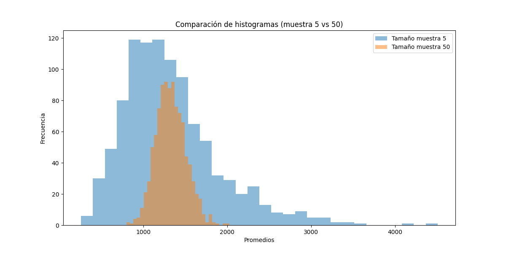

# Resultados de Análisis de Votos

## Resumen General

| Descripción                                | Valor      |
|--------------------------------------------|------------|
| Total de ciudadanos que asistieron a votar | 828275 |
| Total de ciudadanos que no asistieron a votar | 379788 |
| Promedio de los votos en la población      | 1331.63 |

## Pregunta 1: Promedio de los Votos

**Pregunta 1: Promedio de los votos en la población.**
> El promedio de los votos totales en la población es: **1331.63**.

Este cálculo muestra el promedio general considerando todos los votos registrados en el dataset.

## Ejercicio 2 y 3: Diferencias de Promedio

**¿Qué es la semilla?**
> La semilla (en inglés *seed*) es un valor inicial utilizado para generar números aleatorios de forma reproducible.
> Al definir una semilla, aseguramos que los resultados de las simulaciones sean consistentes y puedan repetirse en futuras ejecuciones.

| Ejercicio | Semilla | Promedio Muestra | Diferencia Absoluta |
|-----------|---------|------------------|---------------------|
| 2         | 1       | 1528.40          | 196.77            |
| 3         | 5       | 820.40          | 511.23            |

## Ejercicio 4 y 5: Resultados de Simulaciones

| Simulación      | Porcentaje a más de 1 del promedio |
|-----------------|------------------------------------|
| 1000 muestras   | 99.80%            |
| 10,000 muestras | 99.83%            |

## Ejercicio 6 y 7: Comparación de Histogramas

**Ejercicio 7: Comparación de histogramas.**
> **Respuesta:** Ambos histogramas muestran distribuciones aproximadamente normales. Sin embargo, con un tamaño de muestra de 50, la dispersión es menor, lo que implica que los valores están más concentrados alrededor del promedio de la población.

## Ejercicio 8: Porcentaje en Rango 23-25

| Rango  | Porcentaje Promedios (Muestra 50) | Porcentaje Esperado (Normal) |
|--------|-----------------------------------|-------------------------------|
| 23-25  | 0.00%                      | 97.66%                     |
