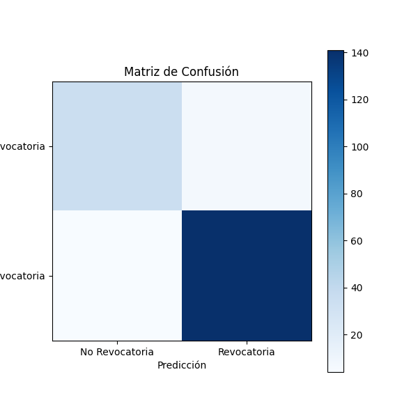
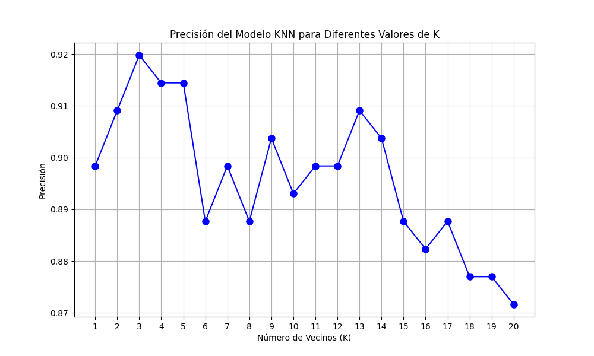

# Análisis de la Revocatoria

Este proyecto analiza los resultados de la revocatoria distrital utilizando un modelo de KNN.

## Resultados

### Matriz de Confusión

### Gráfico de Precisión

## Reporte de Clasificación KNN

| Clase | Precisión | Recall | F1-Score | Soporte |
|-------|-----------|--------|----------|---------|
| **0** | 90%       | 83%    | 86%      | 42      |
| **1** | 95%       | 97%    | 96%      | 145     |

### Métricas Generales:

- **Precisión Total (Accuracy):** 94%
- **Promedio Macro (Macro avg):**
  - **Precisión:** 93%
  - **Recall:** 90%
  - **F1-Score:** 91%
- **Promedio Ponderado (Weighted avg):**
  - **Precisión:** 94%
  - **Recall:** 94%
  - **F1-Score:** 94%

 