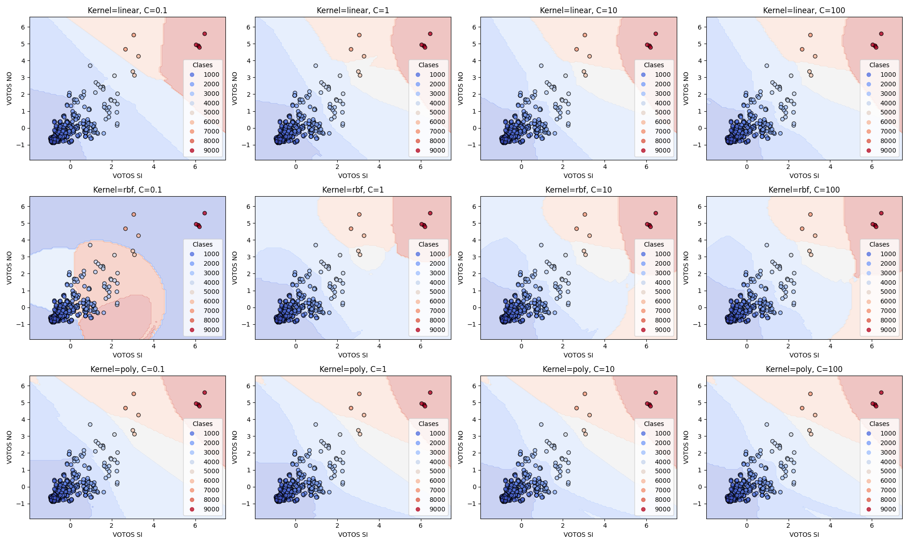

# Resultados detallados del modelo SVM

| **Modelo**                | **Kernel** | **Valor de C** | **Precisi�n** |
|---------------------------|------------|----------------|---------------|
| SVM Modelo Lineal         | linear     | N/A            | 0.72         |
| SVM Modelo con RBF        | rbf        | N/A            | 0.00         |
| SVM Modelo con RBF        | rbf        | 0.1            | 0.00         |
| SVM Modelo con RBF        | rbf        | 1            | 0.00         |
| SVM Modelo con RBF        | rbf        | 10            | 0.04         |
| SVM Modelo con RBF        | rbf        | 100            | 0.13         |

Resultados guardados en 9.- MaquinaSoporteVectorial/README.md

# Resultados detallados del modelo SVM
| **Modelo** | **Kernel** | **Valor de C** | **Precisi�n** |
|------------|------------|----------------|---------------|
| SVM Modelo con linear | linear | 0.1 | 0.01 |
| SVM Modelo con linear | linear | 1 | 0.08 |
| SVM Modelo con linear | linear | 10 | 0.21 |
| SVM Modelo con linear | linear | 100 | 0.33 |
| SVM Modelo con rbf | rbf | 0.1 | 0.01 |
| SVM Modelo con rbf | rbf | 1 | 0.07 |
| SVM Modelo con rbf | rbf | 10 | 0.22 |
| SVM Modelo con rbf | rbf | 100 | 0.31 |
| SVM Modelo con poly | poly | 0.1 | 0.03 |
| SVM Modelo con poly | poly | 1 | 0.05 |
| SVM Modelo con poly | poly | 10 | 0.10 |
| SVM Modelo con poly | poly | 100 | 0.18 |

