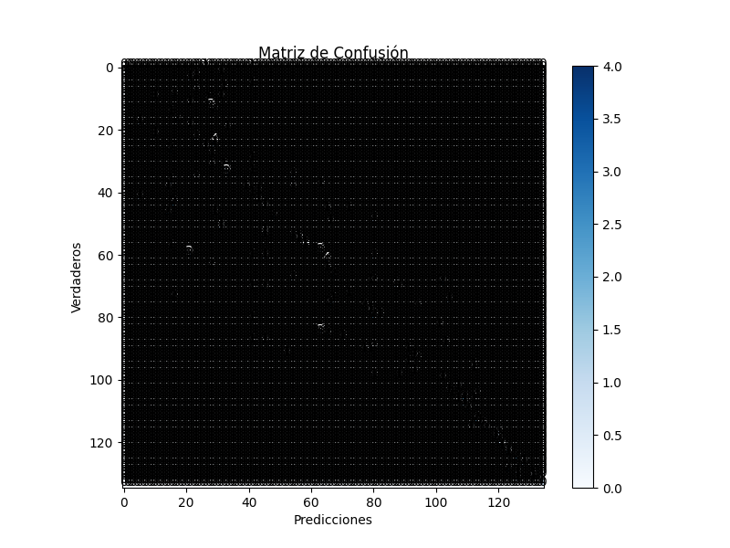

# Análisis de Máquina de Soporte Vectorial

## Descripción del Dataset
Total de registros: 622
## Resultados del Modelo SVM

### Métricas de Rendimiento
```
              precision    recall  f1-score   support

         125       0.00      0.00      0.00         2
         137       1.00      1.00      1.00         2
         158       0.00      0.00      0.00         1
         165       0.00      0.00      0.00         1
         172       0.00      0.00      0.00         1
         175       0.00      0.00      0.00         0
         178       0.00      0.00      0.00         1
         182       0.00      0.00      0.00         1
         194       0.00      0.00      0.00         1
         198       0.00      0.00      0.00         1
         230       0.50      0.50      0.50         2
         238       0.00      0.00      0.00         1
         239       0.00      0.00      0.00         1
         245       0.00      0.00      0.00         3
         247       0.00      0.00      0.00         2
         263       0.20      1.00      0.33         1
         269       0.00      0.00      0.00         0
         270       1.00      1.00      1.00         2
         297       0.00      0.00      0.00         1
         298       0.00      0.00      0.00         1
         310       0.00      0.00      0.00         1
         316       0.00      0.00      0.00         0
         318       0.00      0.00      0.00         1
         327       0.25      1.00      0.40         1
         328       0.00      0.00      0.00         4
         332       0.00      0.00      0.00         1
         341       0.50      1.00      0.67         1
         362       0.00      0.00      0.00         2
         365       0.14      1.00      0.25         1
         374       0.00      0.00      0.00         0
         391       0.00      0.00      0.00         1
         399       0.00      0.00      0.00         0
         429       0.50      0.50      0.50         2
         443       0.20      1.00      0.33         1
         457       0.00      0.00      0.00         4
         476       0.00      0.00      0.00         1
         479       0.00      0.00      0.00         1
         483       0.00      0.00      0.00         1
         485       0.00      0.00      0.00         1
         504       1.00      0.33      0.50         3
         540       0.00      0.00      0.00         1
         556       0.11      1.00      0.20         1
         592       0.00      0.00      0.00         1
         698       0.50      1.00      0.67         1
         703       0.00      0.00      0.00         2
         743       0.14      1.00      0.25         1
         748       0.00      0.00      0.00         2
         757       0.00      0.00      0.00         3
         762       1.00      1.00      1.00         2
         780       0.00      0.00      0.00         1
         808       0.00      0.00      0.00         1
         832       0.00      0.00      0.00         1
         833       0.00      0.00      0.00         1
         837       0.00      0.00      0.00         1
         841       0.25      0.50      0.33         2
         854       0.00      0.00      0.00         1
         858       0.50      1.00      0.67         1
         909       0.00      0.00      0.00         1
         910       0.50      0.50      0.50         2
         934       0.00      0.00      0.00         3
         937       0.00      0.00      0.00         3
         945       0.00      0.00      0.00         3
         952       0.00      0.00      0.00         4
         953       0.00      0.00      0.00         0
         962       0.00      0.00      0.00         2
         966       0.12      1.00      0.22         1
        1028       0.00      0.00      0.00         0
        1033       0.67      1.00      0.80         2
        1050       0.00      0.00      0.00         1
        1102       0.00      0.00      0.00         5
        1125       0.00      0.00      0.00         1
        1134       0.00      0.00      0.00         4
        1148       0.00      0.00      0.00         0
        1176       0.00      0.00      0.00         1
        1183       0.00      0.00      0.00         2
        1250       0.00      0.00      0.00         2
        1274       0.00      0.00      0.00         2
        1277       0.67      0.67      0.67         3
        1283       0.00      0.00      0.00         1
        1293       0.25      1.00      0.40         1
        1316       0.25      0.67      0.36         3
        1325       0.00      0.00      0.00         1
        1326       0.00      0.00      0.00         0
        1331       0.00      0.00      0.00         1
        1335       0.00      0.00      0.00         1
        1336       0.00      0.00      0.00         3
        1344       0.00      0.00      0.00         2
        1365       0.00      0.00      0.00         1
        1407       0.00      0.00      0.00         2
        1408       0.00      0.00      0.00         1
        1421       0.00      0.00      0.00         1
        1442       0.50      0.33      0.40         3
        1450       0.00      0.00      0.00         1
        1453       0.50      1.00      0.67         1
        1476       0.50      1.00      0.67         1
        1567       0.00      0.00      0.00         1
        1578       0.00      0.00      0.00         1
        1579       0.00      0.00      0.00         1
        1594       0.00      0.00      0.00         1
        1707       0.00      0.00      0.00         2
        1720       0.00      0.00      0.00         1
        1751       0.00      0.00      0.00         0
        1757       0.00      0.00      0.00         0
        1818       0.00      0.00      0.00         1
        1829       0.50      1.00      0.67         1
        1841       1.00      0.50      0.67         2
        1979       0.00      0.00      0.00         2
        2006       0.50      0.50      0.50         2
        2054       0.00      0.00      0.00         1
        2056       0.00      0.00      0.00         0
        2110       1.00      1.00      1.00         2
        2179       0.00      0.00      0.00         0
        2227       0.00      0.00      0.00         0
        2320       0.67      1.00      0.80         2
        2410       1.00      1.00      1.00         1
        2770       1.00      1.00      1.00         1
        2919       1.00      0.67      0.80         3
        3035       0.00      0.00      0.00         1
        3069       0.00      0.00      0.00         1
        3071       0.50      1.00      0.67         1
        3108       0.50      1.00      0.67         1
        3177       0.67      1.00      0.80         2
        3199       0.00      0.00      0.00         1
        3460       0.40      1.00      0.57         2
        3630       0.00      0.00      0.00         1
        3637       0.00      0.00      0.00         2
        3838       0.00      0.00      0.00         0
        3888       0.00      0.00      0.00         1
        3890       0.00      0.00      0.00         0
        3891       0.00      0.00      0.00         2
        4009       0.00      0.00      0.00         1
        5595       0.50      1.00      0.67         1
        5596       0.00      0.00      0.00         3
        6034       0.00      0.00      0.00         1
        6823       0.00      0.00      0.00         0

    accuracy                           0.26       187
   macro avg       0.16      0.24      0.17       187
weighted avg       0.20      0.26      0.21       187

```

### Exactitud del Modelo
Exactitud del modelo: 0.2620

### Matriz de Confusión

