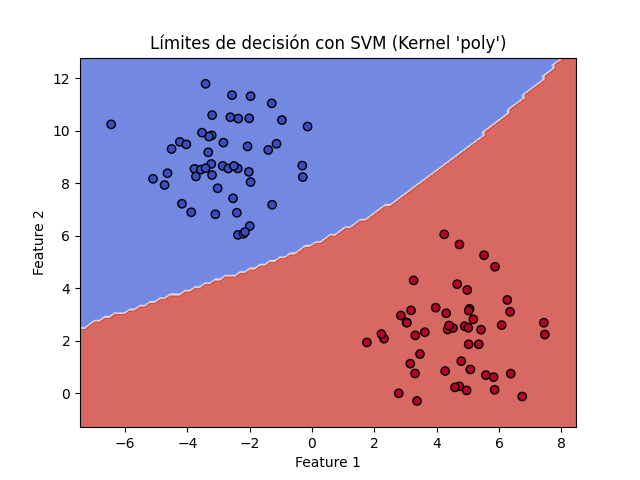
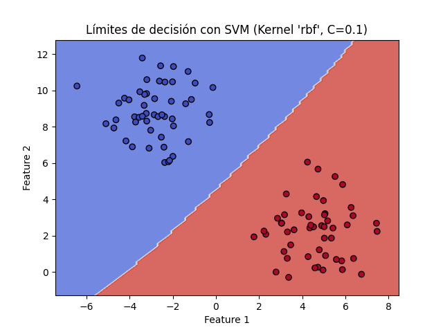
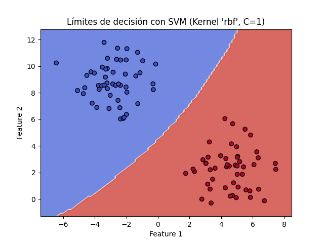
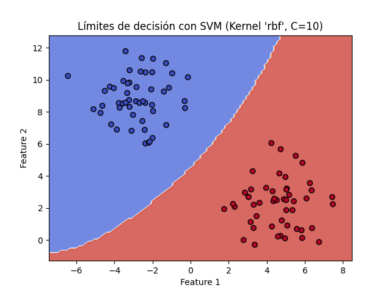

# Resultados del modelo SVM

## Descripción del dataset
El dataset contiene los siguientes atributos:
- **UBIGEO**: Código único de ubicación geográfica.
- **DEPARTAMENTO**: Nombre del departamento.
- **PROVINCIA**: Nombre de la provincia.
- **DISTRITO**: Nombre del distrito.
- **AUTORIDAD EN CONSULTA**: Nombre de la autoridad en consulta.
- **ELECTORES**: Número de electores.
- **VOTOS SI**: Número de votos a favor.
- **VOTOS NO**: Número de votos en contra.
- **VOTOS BLANCOS**: Número de votos en blanco.
- **VOTOS NULOS**: Número de votos nulos.
- **VOTOS IMPUGNADOS**: Número de votos impugnados.
- **VOTOS TOTAL**: Número total de votos.

## Ejercicio 1: SVM con archivo.csv y diferentes kernels
En este ejercicio, se utiliza el dataset `archivo.csv` para entrenar un modelo SVM con diferentes kernels y valores de C. Los atributos del dataset son los siguientes:
- **UBIGEO**: Código único de ubicación geográfica.
- **DEPARTAMENTO**: Nombre del departamento.
- **PROVINCIA**: Nombre de la provincia.
- **DISTRITO**: Nombre del distrito.
- **AUTORIDAD EN CONSULTA**: Nombre de la autoridad en consulta.
- **ELECTORES**: Número de electores.
- **VOTOS SI**: Número de votos a favor.
- **VOTOS NO**: Número de votos en contra.
- **VOTOS BLANCOS**: Número de votos en blanco.
- **VOTOS NULOS**: Número de votos nulos.
- **VOTOS IMPUGNADOS**: Número de votos impugnados.
- **VOTOS TOTAL**: Número total de votos.

### Precisión con kernel 'linear': 0.7165775401069518
### Precisión con kernel 'rbf': 0.0

<<<<<<< Updated upstream
## Ejercicio 1: Clasificación SVM con el dataset desde archivo CSV
Precisión con kernel 'linear': 0.9947
Precisión con kernel 'rbf': 1.0000
=======
>>>>>>> Stashed changes
### Resultados con kernel 'rbf' y diferentes valores de C:
- Precisión con C=0.1: 0.0
- Precisión con C=1: 0.0
- Precisión con C=10: 0.0427807486631016
- Precisión con C=100: 0.13368983957219252

## Ejercicio 2: Límites de decisión con datos generados
En este ejercicio, se generan datos sintéticos para visualizar los límites de decisión de un modelo SVM con diferentes kernels. Los gráficos muestran cómo el modelo separa las dos clases en el espacio de características.

<<<<<<< Updated upstream
---
## Ejercicio 3: Clasificación SVM con el dataset Iris completo y otros datasets
Precisión multiclase con kernel 'rbf' en dataset Iris: 1.0000

### Resultados con diferentes valores de gamma en dataset Iris:
Precisión con kernel 'rbf' y gamma=0.01: 1.0000
Precisión con kernel 'rbf' y gamma=0.1: 1.0000
Precisión con kernel 'rbf' y gamma=1: 1.0000
Precisión con kernel 'rbf' y gamma=10: 0.9778

### Resultados con otros datasets:
Precisión con dataset 'wine': 0.7593
Precisión con dataset 'digits': 0.9870

---
## Ejercicio 4: Optimización de Hiperparámetros con GridSearchCV en el dataset archivo.csv

Mejores parámetros para el kernel 'rbf': {'C': 0.1, 'gamma': 1, 'kernel': 'rbf'}
Mejor precisión en validación cruzada con kernel 'rbf': nan
Precisión en el conjunto de prueba con el mejor modelo (kernel='rbf'): 1.0000
=======
## Ejercicio 3: SVM multiclase con archivo.csv
En este ejercicio, se utiliza el dataset `archivo.csv` para entrenar y evaluar un modelo SVM multiclase. Los resultados muestran la precisión del modelo en el dataset.
### Precisión con dataset 'archivo.csv': 1.0

## Ejercicio 4: Optimización de hiperparámetros
En este ejercicio, se realiza una optimización de hiperparámetros utilizando GridSearchCV para encontrar los mejores valores de C y gamma para un modelo SVM con kernel 'rbf'.
### Mejores parámetros: {'C': 0.1, 'gamma': 0.1, 'kernel': 'rbf'}
### Mejor precisión en validación cruzada: 1.0
## Ejercicio 1: Entrenamiento con kernel 'linear'
Precisión con kernel 'linear': 1.0

## Ejercicio 2: Entrenamiento con kernel 'rbf'
Precisión con kernel 'rbf': 1.0

Resultados con kernel 'rbf' y diferentes valores de C:
Precisión con kernel 'rbf' y C=0.1: 1.0
Precisión con kernel 'rbf' y C=1: 1.0
Precisión con kernel 'rbf' y C=10: 1.0
Precisión con kernel 'rbf' y C=100: 1.0

## Ejercicio 3: Visualización de límites de decisión

Resultados con kernel 'rbf':
## Ejercicio 1: Entrenamiento con kernel 'linear'
Precisión con kernel 'linear': 1.0

## Ejercicio 2: Entrenamiento con kernel 'rbf'
Precisión con kernel 'rbf': 1.0

Resultados con kernel 'rbf' y diferentes valores de C:
Precisión con kernel 'rbf' y C=0.1: 1.0
Precisión con kernel 'rbf' y C=1: 1.0
Precisión con kernel 'rbf' y C=10: 1.0
Precisión con kernel 'rbf' y C=100: 1.0

## Ejercicio 3: Visualización de límites de decisión

Resultados con kernel 'rbf':

Resultados con kernel 'poly':
## Ejercicio 1: Entrenamiento con kernel 'linear'
Precisión con kernel 'linear': 1.0

## Ejercicio 2: Entrenamiento con kernel 'rbf'
Precisión con kernel 'rbf': 1.0

Resultados con kernel 'rbf' y diferentes valores de C:
Precisión con kernel 'rbf' y C=0.1: 1.0
Precisión con kernel 'rbf' y C=1: 1.0
Precisión con kernel 'rbf' y C=10: 1.0
Precisión con kernel 'rbf' y C=100: 1.0

## Ejercicio 3: Visualización de límites de decisión

Resultados con kernel 'rbf':

Resultados con kernel 'poly':

Resultados con kernel 'rbf' y C=0.1:

Resultados con kernel 'rbf' y C=1:

Resultados con kernel 'rbf' y C=10:

## Ejercicio 4: Optimización de hiperparámetros

Mejores parámetros para el kernel 'rbf':{'C': 100, 'gamma': 0.01, 'kernel': 'rbf'}
Mejor precisión en validación cruzada con kernel 'rbf': 0.9714
Precisión en el conjunto de prueba con el mejor modelo (kernel='rbf'): 1.0000

Mejores parámetros para los kernels 'linear' o 'poly':{'C': 0.1, 'gamma': 0.1, 'kernel': 'poly'}
Mejor precisión en validación cruzada con kernels 'linear' o 'poly': 0.9619
Precisión en el conjunto de prueba con el mejor modelo (kernel='linear' o 'poly'): 1.0000

--- Análisis y Comparación de Resultados ---

Resultados con Kernel 'rbf':
- Mejores parámetros: {'C': 100, 'gamma': 0.01, 'kernel': 'rbf'}
- Precisión en validación cruzada: 0.9714
- Precisión en conjunto de prueba: 1.0000

Resultados con Kernels 'linear' o 'poly':
- Mejores parámetros: {'C': 0.1, 'gamma': 0.1, 'kernel': 'poly'}
- Precisión en validación cruzada: 0.9619
- Precisión en conjunto de prueba: 1.0000

Comentarios:
1. La precisión en validación cruzada muestra cómo de bien generaliza el modelo con diferentes configuraciones de hiperparámetros.
2. La precisión en el conjunto de prueba permite evaluar la capacidad del mejor modelo para predecir nuevas instancias.
3. Comparando los kernels 'rbf', 'linear', y 'poly', puedes observar cuál tiene mejor rendimiento en términos de generalización y precisión.
## Ejercicio 1: SVM con archivo.csv y diferentes kernels
Precisión con kernel 'linear': 0.0000
Precisión con kernel 'rbf': 0.0000
Precisión con kernel 'poly': 0.0000
## Ejercicio 2: Límites de decisión con datos generados
## Ejercicio 1: SVM con archivo.csv y diferentes kernels
Precisión con kernel 'linear': 0.0000
Precisión con kernel 'rbf': 0.0000
Precisión con kernel 'poly': 0.0000
## Ejercicio 2: Límites de decisión con datos generados
## Ejercicio 1: SVM con archivo.csv y kernel 'linear'
Precisión con kernel 'linear': 0.0000

## Ejercicio 2: SVM con archivo.csv y kernel 'rbf'
Precisión con kernel 'rbf': 0.0000

Resultados con kernel 'rbf' y diferentes valores de C:
Precisión con kernel 'rbf' y C=0.1: 0.0000
Precisión con kernel 'rbf' y C=1: 0.0000
Precisión con kernel 'rbf' y C=10: 0.0000
Precisión con kernel 'rbf' y C=100: 0.0000

## Ejercicio 3: Visualización de límites de decisión con archivo.csv
## Ejercicio 1: SVM con archivo.csv y kernel 'linear'
Precisión con kernel 'linear': 0.0000

## Ejercicio 2: SVM con archivo.csv y kernel 'rbf'
Precisión con kernel 'rbf': 0.0000

Resultados con kernel 'rbf' y diferentes valores de C:
Precisión con kernel 'rbf' y C=0.1: 0.0000
Precisión con kernel 'rbf' y C=1: 0.0000
Precisión con kernel 'rbf' y C=10: 0.0000
Precisión con kernel 'rbf' y C=100: 0.0000

## Ejercicio 3: Visualización de límites de decisión con archivo.csv
## Ejercicio 1: SVM con archivo.csv y kernel 'linear'
Precisión con kernel 'linear': 0.0000

## Ejercicio 2: SVM con archivo.csv y kernel 'rbf'
Precisión con kernel 'rbf': 0.0000

Resultados con kernel 'rbf' y diferentes valores de C:
Precisión con kernel 'rbf' y C=0.1: 0.0000
Precisión con kernel 'rbf' y C=1: 0.0000
Precisión con kernel 'rbf' y C=10: 0.0000
Precisión con kernel 'rbf' y C=100: 0.0000

## Ejercicio 3: Visualización de límites de decisión con archivo.csv
## Ejercicio 1: SVM con archivo.csv y kernel 'linear'
Precisión con kernel 'linear': 0.0000

## Ejercicio 2: SVM con archivo.csv y kernel 'rbf'
Precisión con kernel 'rbf': 0.0000

Resultados con kernel 'rbf' y diferentes valores de C:
Precisión con kernel 'rbf' y C=0.1: 0.0000
Precisión con kernel 'rbf' y C=1: 0.0000
Precisión con kernel 'rbf' y C=10: 0.0000
Precisión con kernel 'rbf' y C=100: 0.0000

## Ejercicio 3: Visualización de límites de decisión con archivo.csv
## Ejercicio 1: SVM con archivo.csv y kernel 'linear'
Precisión con kernel 'linear': 0.0000

## Ejercicio 2: SVM con archivo.csv y kernel 'rbf'
Precisión con kernel 'rbf': 0.0000

Resultados con kernel 'rbf' y diferentes valores de C:
Precisión con kernel 'rbf' y C=0.1: 0.0000
Precisión con kernel 'rbf' y C=1: 0.0000
Precisión con kernel 'rbf' y C=10: 0.0000
Precisión con kernel 'rbf' y C=100: 0.0000

## Ejercicio 3: Visualización de límites de decisión con archivo.csv
>>>>>>> Stashed changes
