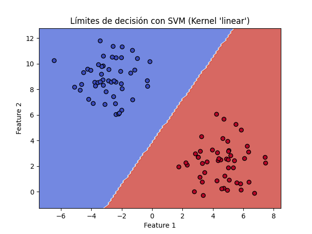
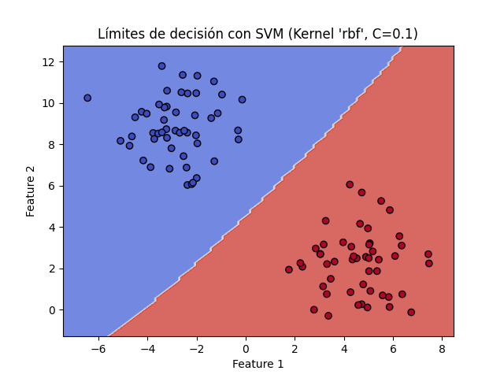
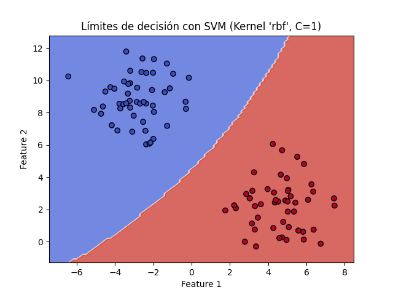
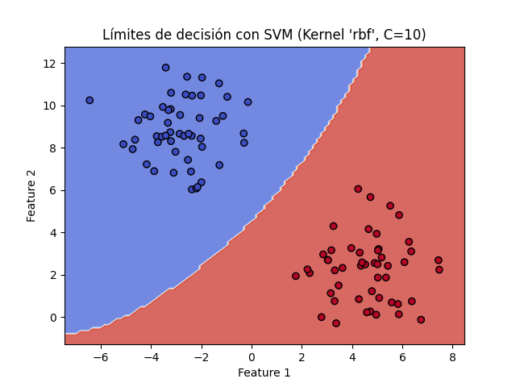

# Proyecto Maquina Vectorial
Este proyecto explora la clasificación utilizando Máquinas de Vectores de Soporte (SVM) con diferentes kernels y parámetros.

## Ejercicio 1: Clasificación SVM con el dataset desde archivo CSV
Precisión con kernel 'linear': 0.9947
Precisión con kernel 'rbf': 1.0000
### Resultados con kernel 'rbf' y diferentes valores de C:
Precisión con kernel 'rbf' y C=0.1: 1.0000
Precisión con kernel 'rbf' y C=1: 1.0000
Precisión con kernel 'rbf' y C=10: 1.0000
Precisión con kernel 'rbf' y C=100: 1.0000

---
## Ejercicio 2: Clasificación SVM con Datos Sintéticos
### Límites de decisión con kernel 'linear':

### Límites de decisión con kernel 'rbf':

### Límites de decisión con kernel 'poly':

### Límites de decisión con kernel 'rbf' y C=0.1:

### Límites de decisión con kernel 'rbf' y C=1:

### Límites de decisión con kernel 'rbf' y C=10:

---
## Ejercicio 3: Clasificación SVM con el dataset Iris completo y otros datasets
Precisión multiclase con kernel 'rbf' en dataset Iris: 1.0000

### Resultados con diferentes valores de gamma en dataset Iris:
Precisión con kernel 'rbf' y gamma=0.01: 1.0000
Precisión con kernel 'rbf' y gamma=0.1: 1.0000
Precisión con kernel 'rbf' y gamma=1: 1.0000
Precisión con kernel 'rbf' y gamma=10: 0.9778

### Resultados con otros datasets:
Precisión con dataset 'wine': 0.7593
Precisión con dataset 'digits': 0.9870

---
## Ejercicio 4: Optimización de Hiperparámetros con GridSearchCV en el dataset archivo.csv

Mejores parámetros para el kernel 'rbf': {'C': 0.1, 'gamma': 1, 'kernel': 'rbf'}
Mejor precisión en validación cruzada con kernel 'rbf': nan
Precisión en el conjunto de prueba con el mejor modelo (kernel='rbf'): 1.0000
