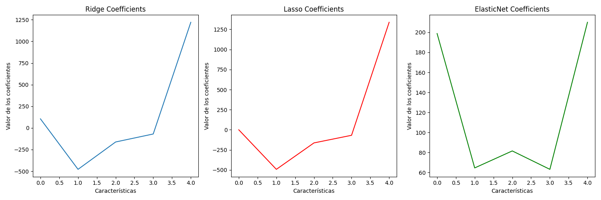

# Regularización en Modelos de Regresión

## Introducción a la Regularización

La **regularización** es una técnica utilizada en la regresión y otros modelos estadísticos para evitar el **sobreajuste (overfitting)**. En modelos de regresión, el sobreajuste ocurre cuando el modelo se ajusta demasiado a los datos de entrenamiento y no generaliza bien a datos nuevos. La regularización agrega un término de penalización a la función de costo, lo que ayuda a reducir la complejidad del modelo y mejora su capacidad de generalización.

### Tipos de Regularización:
1. **Ridge** (L2): Penaliza la magnitud de los coeficientes del modelo. Esto ayuda a reducir los efectos de características irrelevantes, pero no las elimina completamente.
2. **Lasso** (L1): Penaliza la suma de los valores absolutos de los coeficientes. Este tipo de regularización puede llevar algunos coeficientes exactamente a cero, eliminando efectivamente las características menos relevantes.
3. **ElasticNet**: Combinación de Ridge y Lasso, que penaliza tanto la magnitud (L2) como la suma de los coeficientes absolutos (L1).

## Descripción de los Datos

Los datos utilizados provienen de un conjunto de resultados electorales. Cada fila representa los votos recibidos por diferentes candidatos en diversas provincias y distritos. A continuación se detallan las columnas:

- **UBIGEO**: Código único de ubicación geográfica (departamento, provincia, distrito).
- **DEPARTAMENTO**: El departamento del país.
- **PROVINCIA**: La provincia dentro del departamento.
- **DISTRITO**: El distrito dentro de la provincia.
- **AUTORIDAD EN CONSULTA**: Nombre del candidato o autoridad.
- **ELECTORES**: Total de electores registrados.
- **VOTOS SI**: Votos a favor del candidato.
- **VOTOS NO**: Votos en contra.
- **VOTOS BLANCOS**: Votos en blanco.
- **VOTOS NULOS**: Votos nulos.
- **VOTOS IMPUGNADOS**: Votos impugnados.
- **VOTOS TOTAL**: Total de votos, incluyendo todos los anteriores.

Un ejemplo de fila de datos es el siguiente:

250203 | UCAYALI | PADRE ABAD | CURIMANA | ALCIDEs RUBEN RODRIGUEZ INGA | 1126 | 441 | 199 | 68 | 150 | 0 | 858

En este caso, el número de **votos a favor (VOTOS SI)** es 441. Este es el valor que estamos tratando de predecir utilizando los modelos de regresión.

## Resultados del Modelo

Hemos entrenado tres modelos de regresión con regularización: **Ridge**, **Lasso** y **ElasticNet**. A continuación se presentan los **MSE (Mean Squared Error)** de cada modelo en los datos de prueba.

- MSE (Ridge): 239.24802044585567 
- MSE (Lasso): 40.34049330838059 
- MSE (ElasticNet): 44603.56133025498

### Predicciones para un nuevo conjunto de datos:

Ingresamos los siguientes datos para hacer predicciones con cada uno de los modelos:

| **ELECTORES** | **VOTOS NO** | **VOTOS BLANCOS** | **VOTOS NULOS** | **VOTOS IMPUGNADOS** | **VOTOS TOTAL** |
|---------------|--------------|-------------------|-----------------|----------------------|-----------------|
| 1126          | 441          | 199               | 68              | 150                  | 858             |

Las predicciones realizadas por cada modelo fueron:

- Predicciones de Ridge: [430.19016281] 

- Predicciones de Lasso: [444.46732659] 

- Predicciones de ElasticNet: [541.23592787]

Como se puede observar, el modelo de **Lasso** proporciona la predicción más cercana al valor real de **441** (votos a favor), lo que indica que es el modelo que mejor se ajusta a estos datos específicos.

### Visualización de los Coeficientes

A continuación, se presentan los coeficientes de cada modelo:

### Conclusión

El modelo **Lasso**, con su capacidad para penalizar más fuertemente las características irrelevantes, ha mostrado ser el más adecuado para esta predicción en particular, ya que su error cuadrático medio (MSE) es significativamente menor que el de los modelos **Ridge** y **ElasticNet**.

Es importante destacar que la elección del modelo más adecuado puede depender del contexto específico del conjunto de datos y los objetivos del análisis. Sin embargo, en este caso, **Lasso** parece ser el mejor modelo en términos de precisión y ajuste a los datos.
