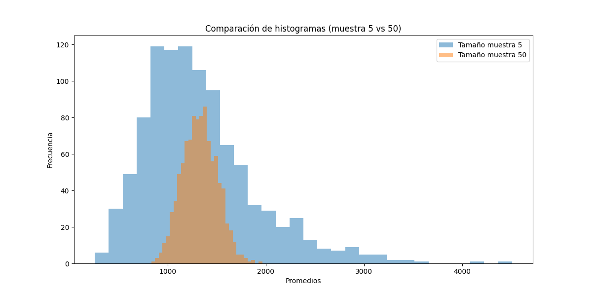

# Resultados de An�lisis de Votos

Este documento presenta los resultados del an�lisis de los votos totales en el dataset proporcionado.

Ejercicio 1: Promedio de los votos en la poblaci�n: 1331.63

Ejercicio 2: Diferencia absoluta (semilla 1): 196.77

Ejercicio 3: Diferencia absoluta (semilla 5): 511.23

Respuesta: C) Porque el promedio de las muestras es una variable aleatoria.

Ejercicio 4: Porcentaje de promedios a m�s de 1 del promedio de x (1000 muestras): 99.80%

Ejercicio 5: Porcentaje de promedios a m�s de 1 del promedio de x (10,000 muestras): 99.82%

Ejercicio 6: Porcentaje de promedios a m�s de 1 del promedio de x (tama�o muestra 50): 99.70%

Respuesta: B) Ambos se ven m�s o menos normales, pero con un tama�o de muestra de 50, la dispersi�n es menor.

Ejercicio 8: Porcentaje de promedios entre 23 y 25 (muestra 50): 0.00%

Ejercicio 8: Porcentaje esperado para distribuci�n normal en rango 23-25: 97.66%

