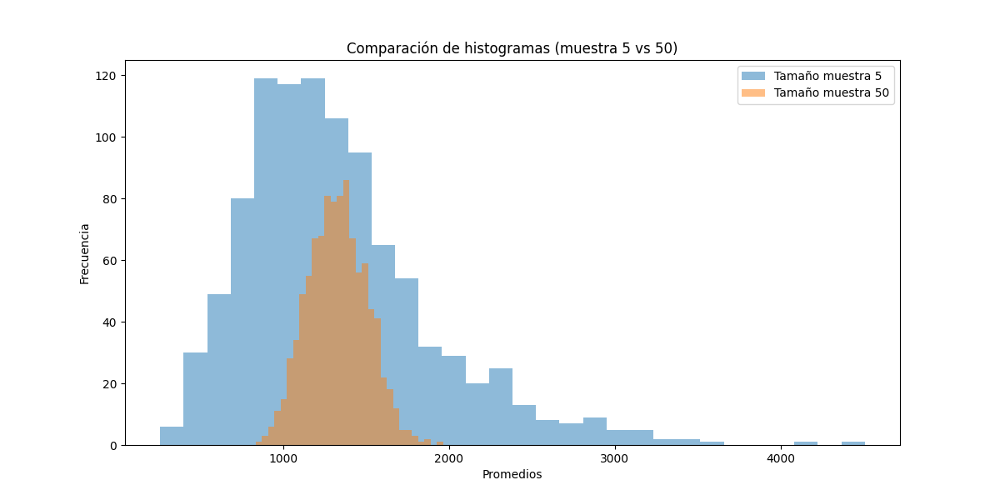

# Resultados de Análisis de Votos

## Resumen General

| Descripción                                | Valor      |
|--------------------------------------------|------------|
| Total de ciudadanos que asistieron a votar | 828275 |
| Total de ciudadanos que no asistieron a votar | 379788 |
| Promedio de los votos en la población      | 1331.63 |

## Ejercicio 2 y 3: Diferencias de Promedio

| Ejercicio | Promedio Muestra | Diferencia Absoluta |
|-----------|------------------|---------------------|
| Semilla 1 | 1528.40          | 196.77            |
| Semilla 5 | 820.40          | 511.23            |

## Ejercicio 4 y 5: Resultados de Simulaciones

| Simulación      | Porcentaje a más de 1 del promedio |
|-----------------|------------------------------------|
| 1000 muestras   | 99.80%            |
| 10,000 muestras | 99.83%            |

## Ejercicio 8: Porcentaje en Rango 23-25

| Rango  | Porcentaje Promedios (Muestra 50) | Porcentaje Esperado (Normal) |
|--------|-----------------------------------|-------------------------------|
| 23-25  | 0.00%                      | 97.66%                     |

## Comparación de Histogramas

